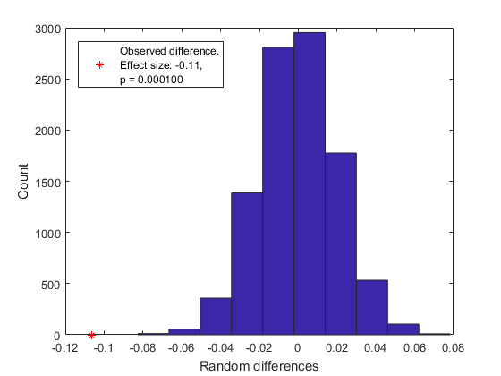

# permutationTest
A permutation test (aka randomisation test) for MATLAB, testing for a difference in means between two samples. It supports one- and two-tailed tests, and returns a p-value, the observed difference, and the effect size. The result can also be visualised using a histogram.

For example, the following tests two samples (n=5000 each) from normal distributions against each other, one shifted .1 to the right (two-tailed, 10000 permutations). It produces the subsequent plot.

```
sample1 = randn(1,5000);
sample2 = randn(1,5000) + .1;
permutationTest(sample1, sample2, 10000, 'plotresult', 1);
```



It is also possible to perform exact tests, during which all possible combinations are considered.